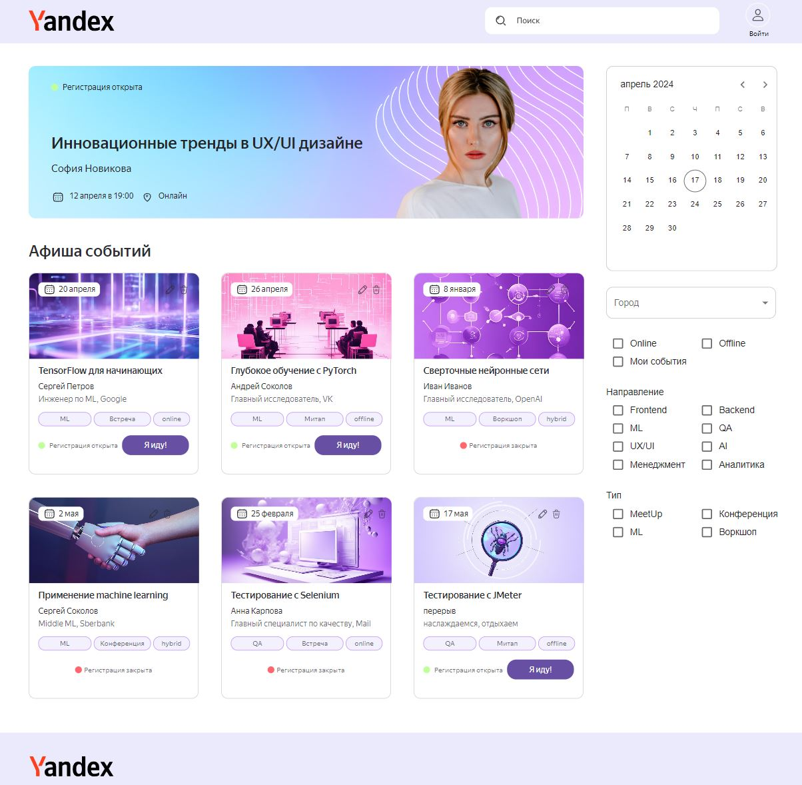
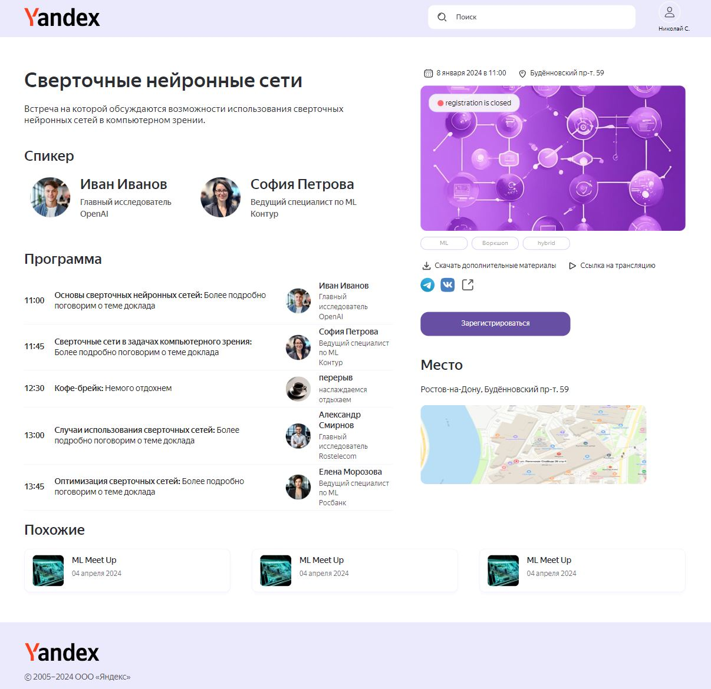
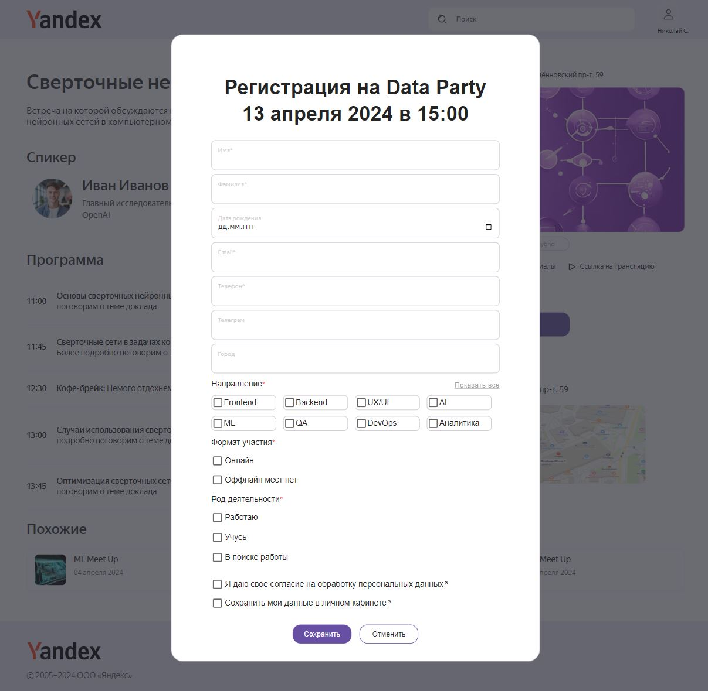
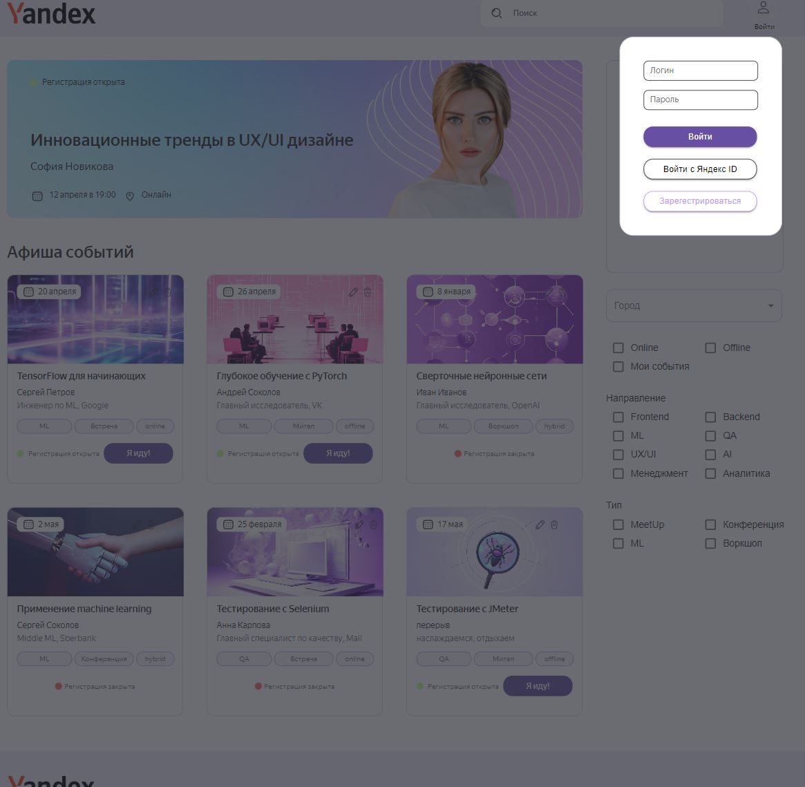
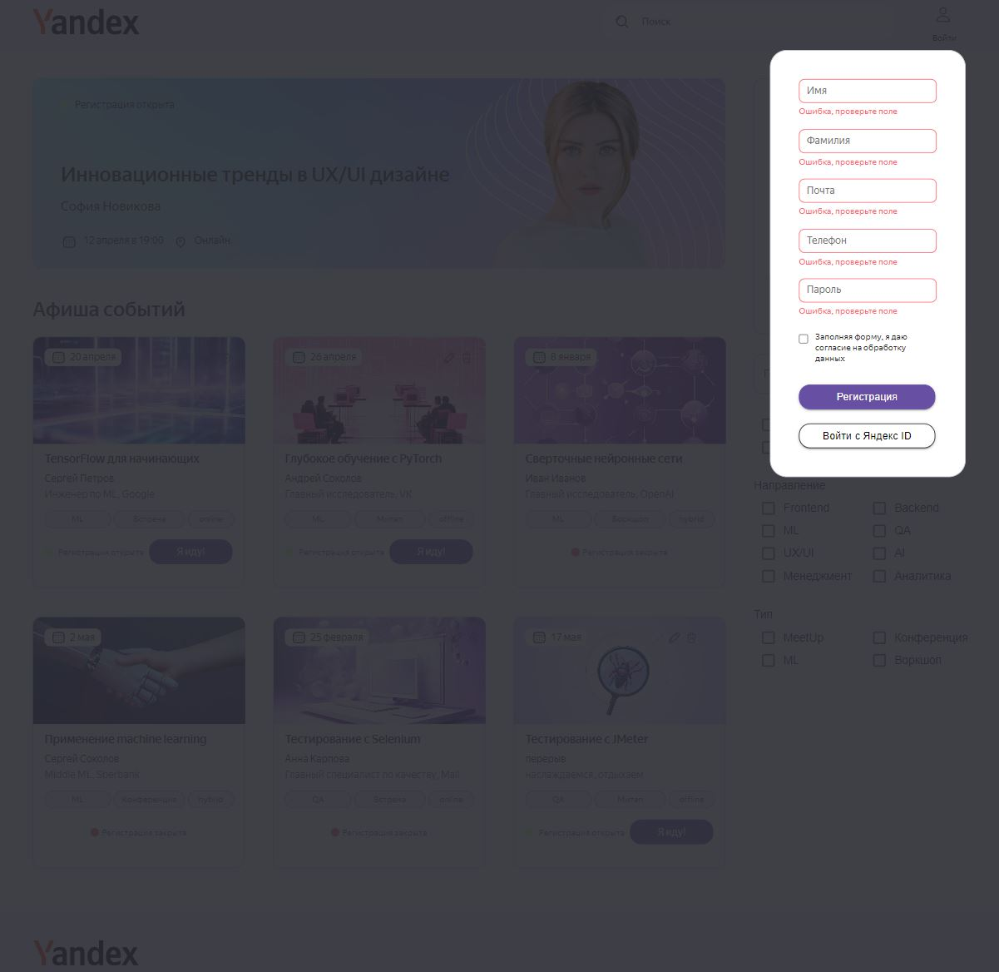
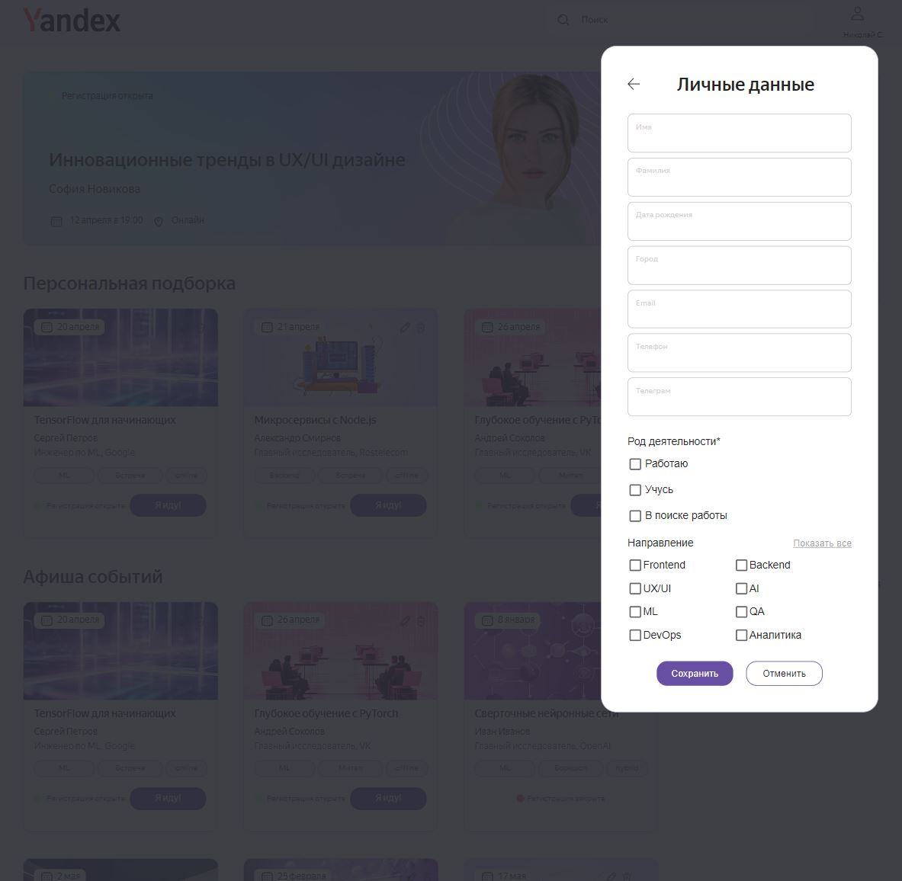
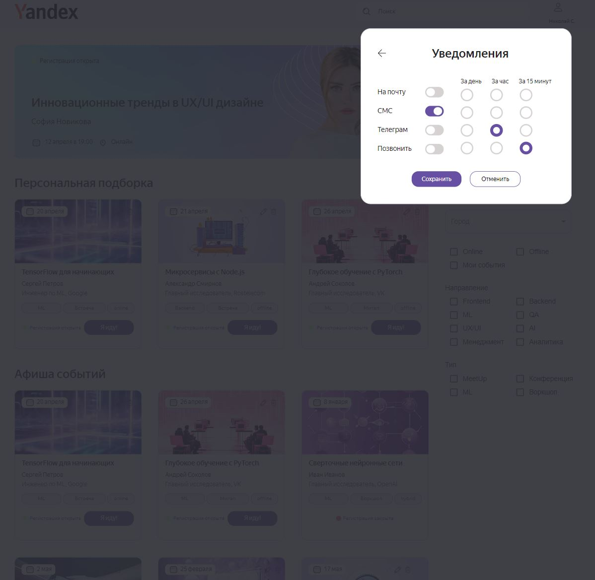
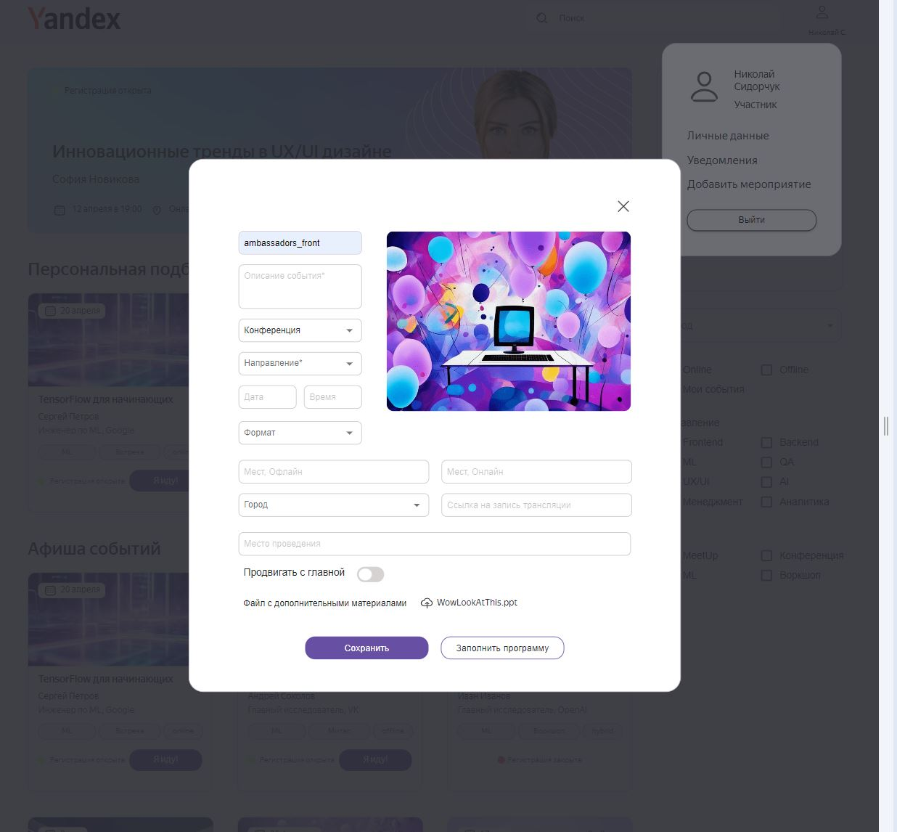
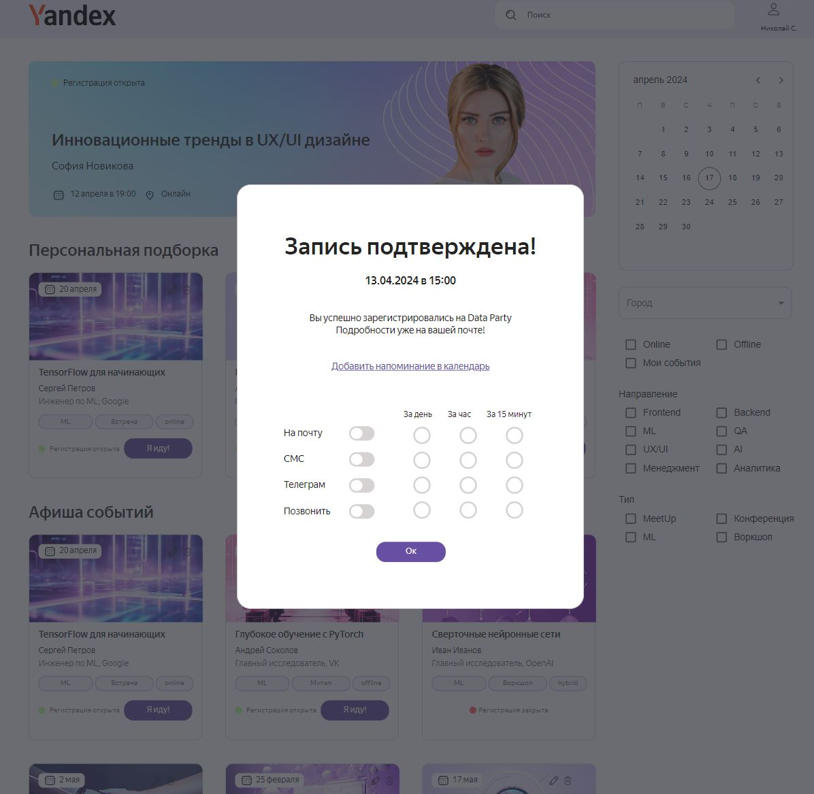

# Frontend для Funtech приложения

Задача Funtech - создание MVP сайта с мероприятиями.

## Описание проекта

Cервис информирования и регистрации представителей IT-сообщества на организованные. Заказчиком мероприятия по различным направлениям IT-индустрии. Сервис позволяет Заказчику создавать и размещать афиши событий на сайте и информировать о них заинтересованных пользователей. Пользователя могут находить интересные мероприятия, регистрироваться на них, получать уведомления и отслеживать свои события удобным способом.

## Используемые технологии

- TS [TypeScript](https://www.typescriptlang.org/)
- ⚛️[React](https://ru.reactjs.org/)

## Сведения о команде:

1. [Сидорчук Николай - Профиль на GitHub](https://github.com/k0t1k777) 

## ссылка на Github Pages
[Ссылка на Github Pages](https://k0t1k777.github.io/Funtech/)

## ссылка на Figma
[Макет Figma](https://www.figma.com/design/dYUCRvGxhI9CPMNLw6JIfk/%D0%A5%D0%B0%D0%BA%D0%B0%D1%82%D0%BE%D0%BD-%D0%B3%D1%80%D1%83%D0%BF%D0%BF%D0%B0-%E2%84%962?node-id=1181-44528&t=ZAD7C5s5oFZRZs26-0)

## Инструкции по установке и запуску

1. Клонируйте репозиторий: `git clone git@github.com:Funtech.git`
2. Перейдите в директорию проекта: `cd Funtech`
3. Установите зависимости: `npm install`
4. Запустите проект: `npm run dev`
5. В браузере открываем `http://localhost:5173/`

Или

1. Переходим по этой ссылке: `https://github.com/Funtech/tree/dev`
2. Нажимаем `Code`
3. Нажимаем `Download ZIP`
4. Распаковываем скачанный архив в любое удобное место
5. Заходим в `Visual Studio Code`, в разделе `Файл` выбираем `Открыть папку`, выбираем распакованную папку, жмём `Ok`
6. В разделе `Терминал` выбираем `Создать терминал`
7. Пишем в терминале: `cd Funtech`
8. Установка зависимости: `npm install`
9. Запуск проект: `npm run dev`
10. В браузере открываем `http://localhost:5173/`

## Библиотеки,которые использовалис

1. yup
2. dayjs
3. mui/material
4. mui/x-date-pickers-pro
5. vite-plugin-svgr
6. ci

## Ключевые точки для медиа min,max-width: 1440px

